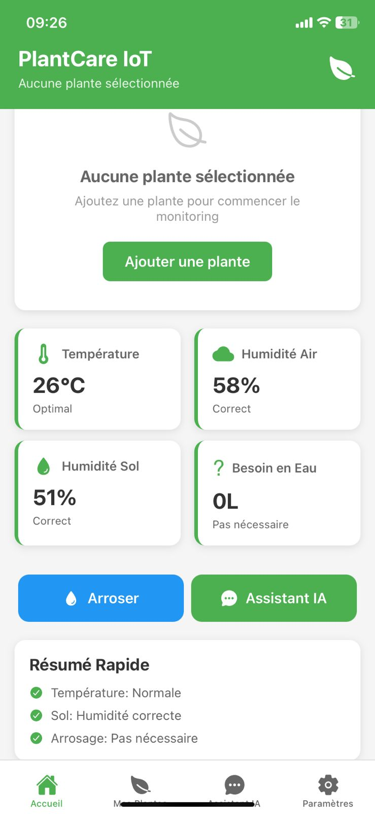
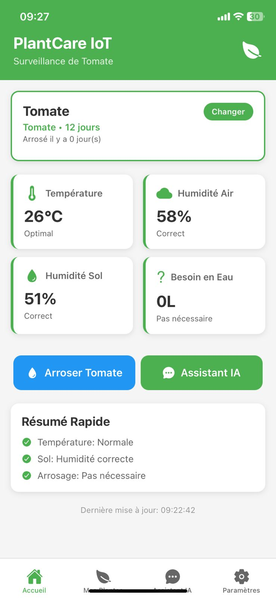
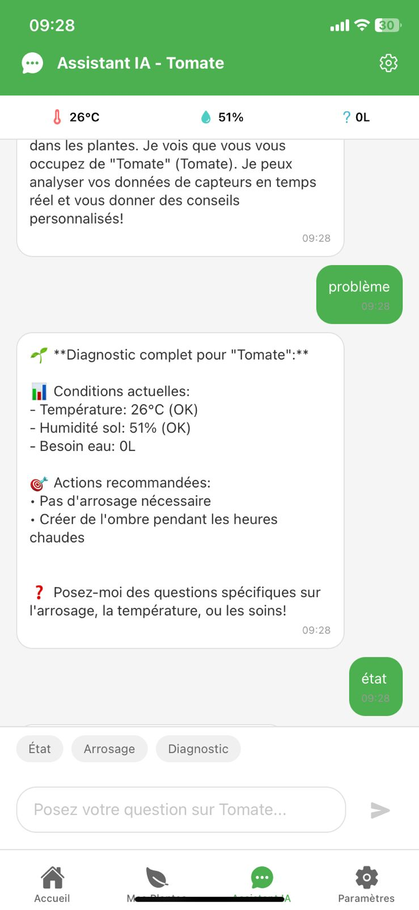

# PlantCare IoT – Système de Surveillance d'Irrigation Intelligent

## Présentation du projet
PlantCare IoT est un système de surveillance d’irrigation intelligent basé sur l’Internet des Objets (IoT) et l’Intelligence Artificielle.  
Le projet vise à automatiser le suivi de l’humidité du sol et de la température ambiante afin d’optimiser l’irrigation agricole.  
Les données collectées par des capteurs sont traitées localement sur un microcontrôleur ESP32, transmises au cloud via Firebase, et visualisées en temps réel sur une application mobile et un tableau de bord web.


## Domaine technique
- Internet des Objets (IoT)
- Agriculture de précision
- Intelligence Artificielle

## Objectifs du projet
- Automatiser la surveillance des paramètres environnementaux des plantes.  
- Optimiser l’utilisation de l’eau à travers des recommandations intelligentes.  
- Fournir une interface intuitive pour la visualisation et la gestion des données en temps réel.

## Technologies utilisées
| Composant | Technologie |
|------------|-------------|
| Microcontrôleur | ESP32 |
| Application mobile | React Native |
| Base de données et cloud | Firebase |
| Analyse intelligente | Python (IA et traitement des données) |
| Communication | WiFi, Bluetooth, Cloud Computing |

## Plateformes cibles
- Android  
- iOS  
- Web Dashboard

## Architecture fonctionnelle
| Étape | Source | Destination | Type de données |
|-------|---------|--------------|-----------------|
| 1. Acquisition | Capteurs IoT | ESP32 | Données brutes (température, humidité) |
| 2. Traitement | ESP32 | Algorithmes locaux | Données filtrées et calculées |
| 3. Transmission | ESP32 | Firebase Cloud | JSON structuré via HTTPS |
| 4. Stockage | Firebase | Base de données | Documents NoSQL et synchronisation en temps réel |
| 5. Distribution | Firebase | Applications (mobile/web) | Données synchronisées |

## Fonctionnalités principales
- Surveillance continue de la température et de l’humidité du sol  
- Transmission et stockage des données en temps réel sur le cloud  
- Visualisation sur une application mobile et un tableau de bord web  
- Recommandations intelligentes d’irrigation basées sur les données collectées  

## Résultats attendus
Le système permet de :
- Réduire la consommation d’eau par une gestion optimisée de l’irrigation  
- Améliorer la santé et la productivité des cultures  
- Offrir un outil simple et efficace pour les agriculteurs et jardiniers  

## Installation et exécution
1. Cloner le dépôt :
   ```bash
   git clone https://github.com/zineb1212/PlantCareApp.git
Ouvrir le projet React Native :

2. bash
    Copier le code
    cd PlantCareApp/mobile
    npm install
    npm start

3. Configurer Firebase :
    Créer un projet Firebase.
    Ajouter le fichier google-services.json (Android) ou GoogleService-Info.plist (iOS).


## Captures d’écran

### Tableau de bord principal


### Suivi des capteurs en temps réel


### Assistant IA pour la gestion de l’irrigation

